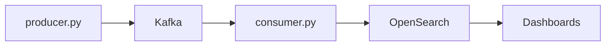
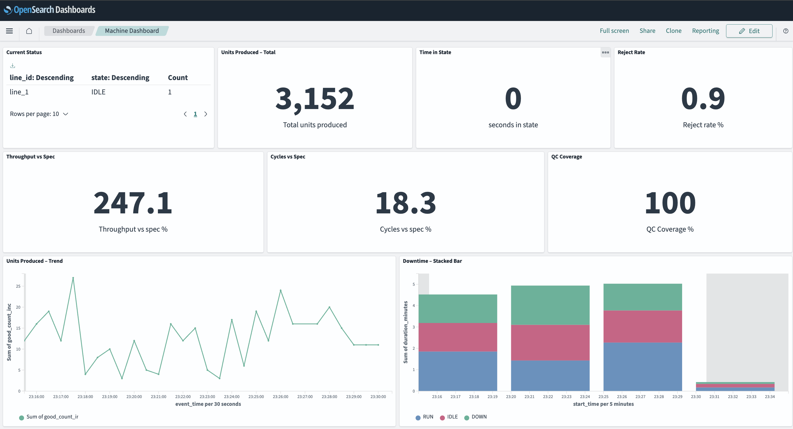
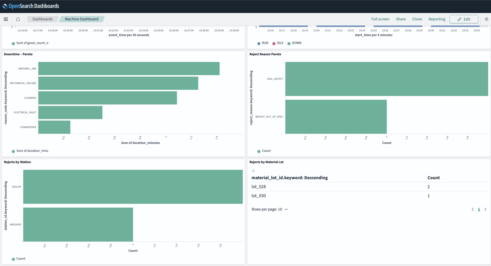

### Objective
System should 
- monitor a factory machine, which is in the process of filling capsules (Nespresso-like) with coffee ground, and
- display real-time data on a dashboard

The end user is a factory operator. Data engineer capstone project.

### Architecture
System simulates a stream of data, passes it through Kafka, validates and saves to OpenSearch. Visualization in OpenSearch Dashboards. One topic used. 

### Stack 
Python, Kafka, OpenSearch, Docker 

### Dashboard
 
 

### Metrics implemented
1. Line status (RUN/IDLE/DOWN/STALE)
2. Units produced (total + trend)
3. Throughput vs spec
4. Cycles vs spec
5. Downtime (trend + pareto)
6. Time-in-State
7. Reject rate
8. Reject reason Pareto
9. Rejects by station
10. QC coverage
11. Scrap by material lot
12. Batch traceability

## How to run
**Pre-conditions**
1. Install and open Docker - https://www.docker.com/products/docker-desktop/ 
2. Clone the repo `git clone https://github.com/makovstanislav/capsule_machine_dashboard`
2. Navigate to the folder `cd capsule_machine_dashboard`
3. Install requirements `pip3 install -r requirements.txt` 

**Run**
1. Start a docker container `docker compose up -d`
2. Run Producer `python3 producer.py`
3. Create a new terminal and run Consumer `python3 consumer.py`

**Verify**
1. Open http://localhost:9200/line_status/_search in a browser 
2. You want to see a dictionary containing the field “state” with the value `RUN`, `IDLE` or `DOWN`
3. For exploring a particular index: get a list `curl -X GET "localhost:9200/_cat/indices?v"` and navigate to http://localhost:9200/{index_name}/_search 

## Data quality gates

**Line status**
1. Rejects events with `state_start_time` in the future
2. Rejects events with `event_time < state_start_time`
3. Rejects out-of-order events (event_time ≤ last seen)
4. Sets state to STALE if no data for 30 seconds
5. Invalid events routed to Dead Letter Queue with rejection reason

**Production**
1. Deduplication via in-memory set (cleared at 10k to prevent memory leak)
2. Idempotent writes to OpenSearch (PUT with event_id as doc_id)

**Downtime**
1. Intervals computed only on state transitions (no double-counting heartbeats)
2. Each DOWN interval carries a `reason_code`
3. Unknown/invalid reason codes replaced with `UNKNOWN_REASON`
4. Reason codes validated against `config/reason_codes.json`

**Reject rate**
1. `reject_rate = rejects / (good + rejects) * 100`
2. Returns 0 (not crash) if denominator is 0
3. Rejects tracked per material lot for traceability

**Throughput & Cycles**
1. Computed only during RUN time (IDLE/DOWN excluded)
2. Returns N/A if RUN minutes = 0
3. Warns if throughput exceeds 110% of spec (possible data bug)
4. Warns if cycles > 0 but units = 0 (suspicious)

**QC coverage**
1. Requires BOTH VISION and CHECKWEIGHER per unit
2. Linked to production by `unit_id`
3. Warns if coverage > 100% (possible duplicates)
4. Warns if coverage < 95% (below threshold)
5. Memory-limited (inspected_units dict cleared at 10k)

**Reject Pareto & Station**
1. `reject_reason` from normalized dictionary (`config/reject_reasons.json`)
2. `station_id` from fixed reference list (`config/stations.json`)

## Roadmap

1. **QC coverage metric.** 
- Add late inspections handling: if inspection timestamp > production_time + 5min -> flag as suspicious
- Missing inspection reasons tracked:
  - unit bypassed inspection (emergency mode?)
  - inspection failed to record (system bug?)
2. **Downtime metric.** Window cutting: intervals crossing window boundaries are clipped correctly.  
  Example: 
    - Downtime in 08:00-09:00 window = 10 min (08:50-09:00) 
    - Downtime in 09:00-10:00 window = 10 min (09:00-09:10) 
    - Total downtime for interval = 20 min (GOOD)
3. **Reject rate metric**. If unit appears in both good AND reject -> reject wins. Business rule: once failed, always failed.
4. Reconciliation checks (sum by reason = total). 
