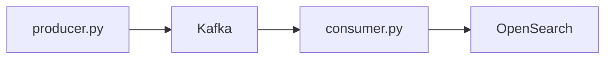

# Real-time coffee capsule machine dashboard

### What it does
1. A dashboard with real-time information about a machine that fills coffee capsules. 
2. End user is a human operator at a factory. 
3. The dashboard displays the line's status, number of units produced, throughput deviations and other indicators. 

### Architecture
System simulates a stream of data, passes it through Kafka, validates the data and saves it to OpenSearch for storage and visualization.

### Stack 
Python, Kafka, OpenSearch, Docker 

> This is a capstone project – the code is written manually. AI is used for review only.

## How to run
**Pre-conditions**
1. Install and open Docker - https://www.docker.com/products/docker-desktop/ 
2. Clone the repo – `git clone https://github.com/makovstanislav/capsule_machine_dashboard`
2. Navigate to the folder – `cd capsule_machine_dashboard`
3. Install requirements – `pip3 install -r requirements.txt` 

**Run**
1. Start a docker container – `docker compose up -d`
2. Run Producer – `python3 producer.py`
3. Create a new terminal and run Consumer – `python3 consumer.py`

**Verify**
1. Open http://localhost:9200/line_status/_search in a browser 
2. You want to see a dictionary containing the field “state” with the value “RUN”, “IDLE” or “DOWN”
