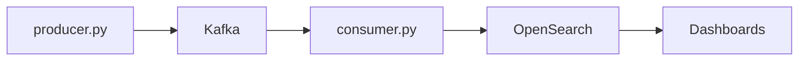

System monitors a coffee capsule filling machine and displays real-time data on a dashboard. The end user is a factory operator. Data engineer capstone project.

### Architecture
System simulates a stream of data, passes it through Kafka, validates and saves to OpenSearch. Visualization in OpenSearch Dashboards. One topic used. 

### Stack 
Python, Kafka, OpenSearch, Docker 

### Dashboard
 
 

### Metrics implemented
1. Line status (RUN/IDLE/DOWN/STALE)
2. Units produced – Total
3. Units produced – Trend
4. Downtime (minutes) – Trend
5. Downtime – Pareto
6. Time-in-State  
7. Reject rate

## How to run
**Pre-conditions**
1. Install and open Docker - https://www.docker.com/products/docker-desktop/ 
2. Clone the repo `git clone https://github.com/makovstanislav/capsule_machine_dashboard`
2. Navigate to the folder `cd capsule_machine_dashboard`
3. Install requirements `pip3 install -r requirements.txt` 

**Run**
1. Start a docker container `docker compose up -d`
2. Run Producer `python3 producer.py`
3. Create a new terminal and run Consumer `python3 consumer.py`

**Verify**
1. Open http://localhost:9200/line_status/_search in a browser 
2. You want to see a dictionary containing the field “state” with the value `RUN`, `IDLE` or `DOWN`
3. For exploring a particular index: get a list `curl -X GET "localhost:9200/_cat/indices?v"` and navigate to http://localhost:9200/{index_name}/_search 

## Data quality gates
**Line status**
1. Rejects events with `state_start_time` in the future (impossible timestamps).
2. Rejects events with `event_time < state_start_time` (impossible time-in-state).
3. Rejects events that arrive late out-of-order – ensures correct order
4. Sets the state as STALE when producer doesn't send data for 30s – prevents false confidence.

**Units produced**
1. Deduplication / idempotency
2. Total over period equals sum of buckets

**Downtime trend**
1. No overlapping intervals per line
2. No double counting or data loss  
  Test case:
    `assert sum(downtime_by_window) == actual_interval_duration`
3. RUN+IDLE+DOWN = window duration 

**Downtime Pareto**
1. Each DOWN interval has `reason_code` 
2. Each reason_code is mapped to category (mechanical / electrical / material)
3. Events with unknown codes are sent to Dead Letter Queue

**Reject rate**
1. `reject_rate = reject_units / (good_units + reject_units)`
2. If `(good+reject)=0` then metric returns N/A (not 0%)
3. No double counting of the same rejected unit 
4. If unit appears in both good AND reject -> reject wins